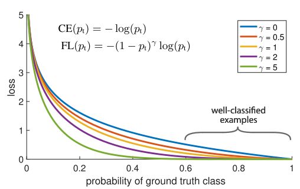

# Loss Functions

## Contents

(Eventually listed in side bar)

1. Loss Function Types
    1. Regression Loss
    2. Binary Classification Loss
    3. Multi-class Classification Loss
        1. Focal Loss

## What and why?

In a neural network, we cannot a priori determine the optimal weights for a network as there are too many unknowns. This means there is a high dimensionality space for the network that cannot be navigated theoretically.

Instead we cast the problem as an optimisation or search problem and utilise an algorithm to navigate the high dimensionality space of possible weights.

The model is typically trained with an optimisation algorithm that utilises a gradient, and the weights are updated through the network using the backpropagation algorithm. The optimiser attempts to reduce the loss by navigating down the gradient of the loss.

The objective function or criterion evaluates candidate solutions (a certain set of weights). In neural network training, we are generally seeking to minimise rather than maximise the objective function, and in this case we may refer to it as the *loss function* (synonymous with error/cost function). Loss functions are essential for the calculation of gradients, which are backpropagated throughout the rest of the network. 

#### Choice of Loss Function

Choosing the right loss function is absolutely vital. The outputs of the loss function are the metric through which the model sees the world and the system it is trying to mimic, and tell it if it is improving or worsening. In that way the loss function serves as the "reality check" for the model. If this reality check mirrors reality poorly, then it follows that the trained model will also perform poorly when working on real data.

It must faithfully distill all aspects, both good and bad, of the model down to a single scalar value which then allows candidate solutions to be ranked and compared. 

## Types of Loss Function

Choosing a different loss function can significantly affect the final model that is produced. Here I will talk about the different types of loss function and when and where they may apply. This is far from an exhaustive list, but contains many of the most common and reapplicable loss functions. When you are considering your problem you must always carefully consider what model you want and what is the most useful model, which depending on your real-world problem, may not always be the model with the highest accuracy! Coming up with bespoke loss functions for problems can often yield a more useful model, and is something that should be considered.

### Cross-Entropy Loss

#### Equation

\begin{equation*}
CE(p_i) = 
\begin{cases}
\log(p),  & \text{if $y=1$} \\
\log(1-p), & \text{otherwise}
\end{cases}
\end{equation*}

Where $y$ which is the ground-truth and $ p \in [0,1] $ is the probability $ y = 1 $

Binary classification loss

\begin{equation*}
BCE(p_i) = - \frac{1}{N} \Sigma^N_{i=1}  y_i \log(p_i) + (1 - y_i) \log(1-p_i)
\end{equation*}

where $p_i = p(y_i)$

### Focal Loss

#### Explanation

Focal Loss works by 'focusing' loss where it is needed to avoid overfitting in the model. It helps numerous easy examples from overwhelming the gradient. As can been seen in the figure below, loss for easily classified examples is reduced. Whilst when $ p_t \rightarrow 0 $, $ FL \rightarrow CE $ .

#### Equation
Focusing on the binary case. 

Substituting for simplicity:

\begin{equation*}
p_t = 
\begin{cases}
p,  & \text{if $y=1$} \\
1-p, & \text{otherwise}
\end{cases}
\end{equation*}

Introducing the modulating factor $ - ( 1- p_t)^\gamma $ into Cross-Entropy Loss:

\begin{equation*}
FL(p_t) = - ( 1- p_t)^\gamma  \log(p_t)
\end{equation*}

When $ \gamma = 0 $, $ FL = CE$ 

Incorporating a weighting factor, either set by inverse class frequency or hyperparameter tuning, $\alpha$, where $\alpha \in [0,1]$. 

Examples for $ y=1 $ are weighted by $ \alpha $ and $y=0$ by $1- \alpha$. Subtituting $\alpha_t$ for simplicity as above.

\begin{equation*}
FL(p_t) = - \alpha_t( 1- p_t)^\gamma  \log(p_t)
\end{equation*}

#### Strengths and Use Cases

* Dealing with unbalanced datasets by increasing loss on classes with few datapoints.

* Helping models predict harder classes by increasing the loss on them and reducing loss where the model is already accurate. Avoiding excessive divergence from solutions to the harder classes by reducing the impact of optimisation to easier classes.

#### Weaknesses

\ref

### Softmax vs Sigmoid

https://stats.stackexchange.com/questions/233658/softmax-vs-sigmoid-function-in-logistic-classifier

### Further Reading

* Focal Loss for Dense Object Detection (https://arxiv.org/abs/1708.02002)

